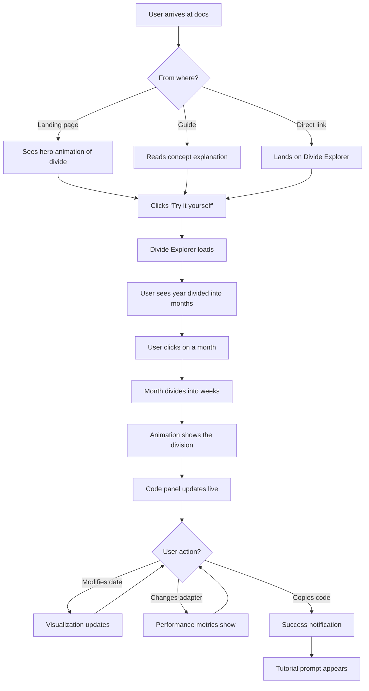

# useTemporal Interactive Documentation UI/UX Specification

## Introduction

This document defines the user experience goals, information architecture, user flows, and visual design specifications for useTemporal Interactive Documentation's user interface. It serves as the foundation for visual design and frontend development, ensuring a cohesive and user-centered experience.

### Overall UX Goals & Principles

#### Target User Personas

1. **Time-Curious Developer**: Developers who are evaluating useTemporal for their projects. They need to quickly understand what makes useTemporal unique (the divide() pattern) and see it in action before committing.

2. **Implementation Developer**: Developers actively integrating useTemporal into their applications. They need clear, interactive examples they can modify and test to understand exact behavior.

3. **Learning Developer**: Developers who want to deeply understand time manipulation concepts. They benefit from visualizations that make abstract time concepts tangible.

#### Usability Goals

- **Immediate Understanding**: Users can grasp the divide() pattern within 30 seconds through interactive visualization
- **Exploration-Driven Learning**: Users can modify parameters and see results instantly without leaving the documentation
- **Copy-Ready Code**: Every interactive example generates production-ready code that users can copy
- **Progressive Complexity**: Start with simple interactions, reveal advanced features as users explore

#### Design Principles

1. **Show, Don't Just Tell** - Every concept should have an interactive demonstration
2. **Instant Feedback** - Changes to parameters immediately update visualizations and code
3. **Reality-Based Examples** - Use real calendar widgets and date pickers, not abstract demonstrations
4. **Accessible Interaction** - All interactions work with keyboard, mouse, and touch
5. **Performance First** - Interactions must feel instantaneous (< 100ms response time)

### Change Log

| Date | Version | Description | Author |
|------|---------|-------------|--------|
| 2025-07-25 | 1.0 | Initial specification | Sally (UX Expert) |

## Information Architecture (IA)

### Site Map / Screen Inventory

### Navigation Structure

**Primary Navigation:** Horizontal top bar with: Guide | Interactive Playground | API | Examples

**Secondary Navigation:** 
- Within Interactive Playground: Sidebar with categorized interactive components
- Contextual "Try It" buttons throughout regular documentation that deep-link to relevant playground sections

**Breadcrumb Strategy:** Show full path for orientation, with dropdown on each segment for quick navigation to sibling pages

## User Flows

### Flow 1: Discovering the Divide Pattern

**User Goal:** Understand what makes useTemporal unique and why they should use it

**Entry Points:** 
- Landing page "See it in Action" button
- Guide > Core Concepts > Divide Pattern
- Direct link from blog posts/social media

**Success Criteria:** User can explain the divide pattern and has copied example code

#### Flow Diagram

#### Edge Cases & Error Handling:
- Invalid date input: Show friendly error with example of correct format
- Adapter not loading: Fallback to native adapter with explanation
- Animation lag: Reduce animation complexity on slower devices

**Notes:** The key insight is showing the hierarchical nature of time through smooth animations

### Flow 2: Building a Calendar Widget

**User Goal:** Create a functional calendar component using useTemporal

**Entry Points:**
- Examples > Calendar
- Interactive Playground > Calendar Builder
- Search for "calendar"

**Success Criteria:** User has a working calendar with their chosen framework and configuration

#### Flow Diagram

#### Edge Cases & Error Handling:
- Framework conflicts: Clear compatibility notes
- Complex configurations: Progressive disclosure of advanced options
- Mobile interaction: Touch-optimized controls

**Notes:** Start with sensible defaults so the calendar works immediately

### Flow 3: Comparing Adapters

**User Goal:** Choose the right adapter for their project needs

**Entry Points:**
- Guide > Adapters
- Interactive Playground > Adapter Comparison
- Performance concerns from search

**Success Criteria:** User selects appropriate adapter with confidence in their choice

#### Flow Diagram

#### Edge Cases & Error Handling:
- Adapter fails to load: Show N/A with explanation
- Performance varies widely: Show ranges with context
- Browser incompatibility: Note which adapters work where

**Notes:** Real-time benchmarking on user's actual device provides most relevant data