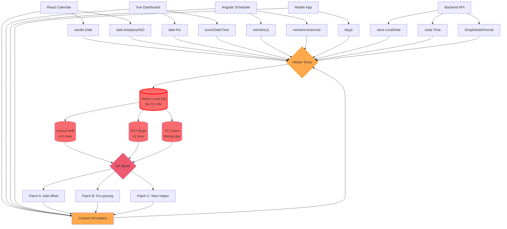
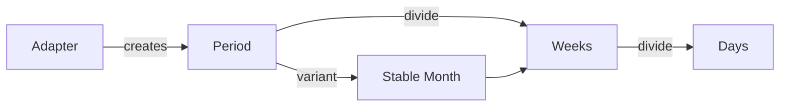

<h1 class="text-lg font-700">useTemporal</h1>
<h1>Declarative Calender Library</h1>

<div>
  Aleksej Dix · CTO @ Ally Studio and Head of Frontend @ Medidata
</div>

---

<h1 class="text-lg font-700 text-center">The Journey In Six Visual Steps</h1>

<div class="grid grid-cols-3 gap-4 mt-12 text-left">
  <div class="bg-white/5 border border-black p-4">
    <div class="text-3xl font-bold">01</div>
    <div class="text-base uppercase tracking-widest opacity-70">Context</div>
    <p class="mt-3 text-sm opacity-80">Swiss-local DBs, traveling users, invisible drift.</p>
  </div>
  <div class="bg-white/5 border border-black p-4">
    <div class="text-3xl font-bold">02</div>
    <div class="text-base uppercase tracking-widest opacity-70">Pain Map</div>
    <p class="mt-3 text-sm opacity-80">Imperative helpers, unstable layouts.</p>
  </div>
  <div class="bg-white/5 border border-black p-4">
    <div class="text-3xl font-bold">03</div>
    <div class="text-base uppercase tracking-widest opacity-70">Architecture</div>
    <p class="mt-3 text-sm opacity-80">Adapter → Period → devide → Stable Month</p>
  </div>
  <div class="bg-white/5 border border-black p-4">
    <div class="text-3xl font-bold">04</div>
    <div class="text-base uppercase tracking-widest opacity-70">Before/After</div>
    <p class="mt-3 text-sm opacity-80">Plain JS comparison.</p>
  </div>
  <div class="bg-white/5 border border-black p-4">
    <div class="text-3xl font-bold">05</div>
    <div class="text-base uppercase tracking-widest opacity-70">Demo Flow</div>
    <p class="mt-3 text-sm opacity-80">Live steps to inspect periods.</p>
  </div>
  <div class="bg-white/5 border border-black p-4">
    <div class="text-3xl font-bold">06</div>
    <div class="text-base uppercase tracking-widest opacity-70">Adoption</div>
    <p class="mt-3 text-sm opacity-80">Checklist for teams.</p>
  </div>
</div>

---

<h1 class="text-lg font-700 text-center">Date Time Savings — October 26</h1>

<DstReminder />

---

<h1 class="text-lg font-700 text-center">Pain Map</h1>



- **4 frontend teams** mixing 8+ date libraries (vanilla Date, date-fns, luxon, moment.js, dayjs...)
- **Backend** uses 3 different Java time APIs, all writing to Swiss Local DB with no timezone info
- Everything funnels through **"Helper Soup"** - a 2000+ line utility file nobody understands
- **3 failure modes**: Layout Drift (4-6 rows), DST Bugs (±1 hour), Timezone Chaos (wrong day)
- **The death spiral**: QA finds bugs → 3 new patches → Back to Custom formatters → More bugs
- No shared data model to inspect; each team logs incompatible formats

---

# Step 02 · Imperative Builder (Real Production Code)

```js {1-40|3-8|10-16|18-28|30-38}
// WARN: Do NOT touch this without testing Swiss local first!
// Last modified: 2023-10-27 (DST bug hotfix)
function buildCalendarGrid(cursor, weekStartsOn = 1) {
  const cells = [];

  // Get first of month in LOCAL time (critical for Swiss DB!)
  const monthStart = new Date(cursor.getFullYear(), cursor.getMonth(), 1);

  // BUG FIX 2022-03-15: was off by 1 during DST transition
  let dayOfWeek = monthStart.getDay();
  let offset = (dayOfWeek - weekStartsOn + 7) % 7;

  // HACK: Add 1 hour to avoid DST midnight weirdness
  // See ticket #4521 - March 2023 DST incident
  const gridStart = new Date(
    monthStart.getTime() - offset * 86400000 + 3600000
  );

  // Build 6 weeks (42 cells) - hardcoded because dynamic sizing broke QA
  for (let i = 0; i < 42; i++) {
    // Clone to avoid mutation bugs (learned the hard way)
    const cell = new Date(gridStart.getTime());
    cell.setDate(cell.getDate() + i);

    // FIXME: This breaks when user timezone != Swiss local
    // TODO: Refactor after Q2 launch (LOL never happens)
    const inMonth = cell.getMonth() === cursor.getMonth();
  }

  return cells;
}
```

---

<h1>Bugs in every Row</h1>

<div>
  <ul>
    <li>DST hotfix with magic +1 hour offset (line 16)</li>
    <li>Hardcoded 42 cells because "dynamic sizing broke QA"</li>
    <li>Time zone assumptions baked into logic (line 25 comment)</li>
    <li>Multiple TODO/FIXME comments from 2022-2023</li>
    <li>No shared Period type—just raw Dates with boolean flags</li>
  </ul>
</div>

---

<h1 class="text-lg font-700 text-center">Hierarchy of Time</h1>

<div class="flex flex-col items-center gap-4 my-6">
  <!-- Year -->
  <div class="inline-block bg-cyan-400 border-3 border-cyan-700 rounded-lg px-6 py-3 font-bold text-gray-900">
    Year 2025
  </div>

  <div class="text-xl opacity-50">↓ divide</div>

  <!-- Months -->
  <div class="flex gap-2 items-center flex-wrap justify-center text-sm">
    <div class="bg-white/10 border-2 border-white/30 rounded px-3 py-1.5">Jan</div>
    <div class="bg-white/10 border-2 border-white/30 rounded px-3 py-1.5">Feb</div>
    <div class="bg-cyan-400 border-2 border-cyan-700 rounded px-3 py-1.5 font-bold text-gray-900">Mar</div>
    <div class="bg-white/10 border-2 border-white/30 rounded px-3 py-1.5">Apr</div>
    <div class="bg-white/10 border-2 border-white/30 rounded px-3 py-1.5">May</div>
    <div class="bg-white/10 border-2 border-white/30 rounded px-3 py-1.5">Jun</div>
    <div class="bg-white/10 border-2 border-white/30 rounded px-3 py-1.5">Jul</div>
    <div class="bg-white/10 border-2 border-white/30 rounded px-3 py-1.5">Aug</div>
    <div class="bg-white/10 border-2 border-white/30 rounded px-3 py-1.5">Sep</div>
    <div class="bg-white/10 border-2 border-white/30 rounded px-3 py-1.5">Oct</div>
    <div class="bg-white/10 border-2 border-white/30 rounded px-3 py-1.5">Nov</div>
    <div class="bg-white/10 border-2 border-white/30 rounded px-3 py-1.5">Dec</div>
  </div>

  <div class="text-xl opacity-50">↓ divide</div>

  <!-- Days -->
  <div class="flex gap-2 items-center flex-wrap justify-center text-sm">
    <div class="bg-white/10 border-2 border-white/30 rounded px-3 py-1.5">Mar 10</div>
    <div class="bg-white/10 border-2 border-white/30 rounded px-3 py-1.5">Mar 11</div>
    <div class="bg-white/10 border-2 border-white/30 rounded px-3 py-1.5">Mar 12</div>
    <div class="bg-cyan-400 border-2 border-cyan-700 rounded px-3 py-1.5 font-bold text-gray-900">Mar 13</div>
    <div class="bg-white/10 border-2 border-white/30 rounded px-3 py-1.5">Mar 14</div>
    <div class="bg-white/10 border-2 border-white/30 rounded px-3 py-1.5">Mar 15</div>
    <div class="bg-white/10 border-2 border-white/30 rounded px-3 py-1.5">Mar 16</div>
  </div>

  <div class="text-xl opacity-50">↓ divide</div>

  <!-- Hours -->
  <div class="flex gap-2 items-center flex-wrap justify-center text-sm">
    <div class="bg-white/10 border-2 border-white/30 rounded px-3 py-1.5">00:00</div>
    <div class="bg-white/10 border-2 border-white/30 rounded px-3 py-1.5">01:00</div>
    <div class="bg-red-500 border-3 border-red-700 rounded px-3 py-1.5 font-bold text-white">02:00</div>
    <div class="bg-white/10 border-2 border-white/30 rounded px-3 py-1.5">03:00</div>
    <div class="bg-white/10 border-2 border-white/30 rounded px-3 py-1.5">04:00</div>
    <div class="bg-white/10 border-2 border-white/30 rounded px-3 py-1.5">05:00</div>
  </div>

  <div class="text-xl opacity-50">↓ divide</div>

  <!-- Minutes -->
  <div class="flex gap-2 items-center flex-wrap justify-center text-xs">
    <div class="bg-red-500 border-2 border-red-700 rounded px-2 py-1 font-bold text-white">02:00</div>
    <div class="bg-red-300 border-2 border-red-500 rounded px-2 py-1 text-gray-900">02:01</div>
    <div class="bg-red-300 border-2 border-red-500 rounded px-2 py-1 text-gray-900">02:02</div>
    <div class="bg-red-300 border-2 border-red-500 rounded px-2 py-1 text-gray-900">02:03</div>
    <div class="bg-red-300 border-2 border-red-500 rounded px-2 py-1 text-gray-900">02:04</div>
    <div class="bg-red-300 border-2 border-red-500 rounded px-2 py-1 text-gray-900">02:05</div>
  </div>
</div>

<div class="mt-4 text-sm opacity-80">
  <p><strong>The Pattern:</strong> Year → Month → Day → Hour → Minute → Second</p>
  <p class="mt-2">Every level is a <strong>Period</strong> with <code>{ start, end, type }</code></p>
  <p class="mt-2">The red hour (02:00-03:00)? That's the DST "spring forward" that <strong>doesn't exist</strong> in Switzerland on March 30.</p>
  <p class="mt-2"><strong>useTemporal's divide() gives you ANY level from ANY starting period.</strong></p>
</div>

---

# Architecture Sketch



- Adapter = time math brain (Temporal or Date).
- Period = plain object units we can log/test.
- divide() gives deterministic slices.
- Stable Month ensures UI surfaces stay aligned.

<div class="mt-4 text-sm opacity-70">
  Horizontal flow clarifies how data moves: Adapter → Period → Weeks → Days, with Stable Month branching to keep layout steady.
</div>

---

# Key Building Blocks

<div class="grid grid-cols-4 gap-4 text-left">
  <div class="border p-4">
    <div class="text-sm uppercase tracking-wide ">Adapter</div>
    <p class="text-lg font-bold mt-1">4 operations</p>
    <p class="text-sm opacity-80 mt-2">startOf, endOf, add, diff</p>
  </div>
  <div class="border p-4">
    <div class="text-sm uppercase tracking-wide ">Period</div>
    <p class="text-lg font-bold mt-1">Serializable slice</p>
    <p class="text-sm opacity-80 mt-2">{ start, end, type, date }</p>
  </div>
  <div class="border p-4">
    <div class="text-sm uppercase tracking-wide ">Units</div>
    <p class="text-lg font-bold mt-1">Extensible types</p>
    <p class="text-sm opacity-80 mt-2">year, month, week, day...</p>
  </div>
  <div class="border p-4">
    <div class="text-sm uppercase tracking-wide ">Temporal</div>
    <p class="text-lg font-bold mt-1">State container</p>
    <p class="text-sm opacity-80 mt-2">browsing, now, config</p>
  </div>
</div>

---

# useTemporal

```vue {1-16|2-7|9-14}
<!-- App.vue -->
<script setup lang="ts">
import { ref } from "vue";
import { Temporal } from "@allystudio/usetemporal-vue";
import { createNativeAdapter } from "@allystudio/usetemporal/native";

const adapter = createNativeAdapter({
  weekStartsOn: 1,
  timeZone: "Europe/Zurich",
});
const date = ref(new Date("2025-03-13"));
</script>

<template>
  <Temporal :adapter="adapter" :date="date">
    <MonthGrid />
  </Temporal>
</template>
```

---

```vue {all|4-7}
<!-- MonthGrid.vue -->
<script setup lang="ts">
import { computed } from "vue";
import { useTemporal, usePeriod } from "@allystudio/usetemporal-vue";
import { divide } from "@allystudio/usetemporal/operations";

const temporal = useTemporal();
const month = usePeriod(temporal, "month");
const days = computed(() => divide(temporal.adapter, month.value, "day"));
</script>

<template>
  <div class="calendar">
    <div v-for="day in days" :key="day.start.toISOString()">
      {{ day.start.getDate() }}
    </div>
  </div>
</template>
```

<div class="mt-6 text-sm opacity-70">
  <strong>Core primitives in action:</strong> <code>usePeriod()</code> creates a reactive month, <code>divide()</code> breaks it into days. That's the entire calendar logic.
</div>

---

# Step 04 · Calendar Superpowers (Live)

<CalendarSuperpowers />

---

# How many hours do we have in 1 day?

---

# How many hours do we have in 1 day?

## 26

---

# Timezone Offsets At A Glance

<TimezoneShowcase />

---

# How many week we have in a month?

---

# How many week we have in a month?

## 4 - 6

---

# Step 05 · Natural Month Shapes

```text
4-week month (Feb 2026) · starts on Monday
Row 1: [Mon] 01  02  03  04  05  06
Row 2: [Mon] 08  09  10  11  12  13
Row 3: [Mon] 15  16  17  18  19  20
Row 4: [Mon] 22  23  24  25  26  27
```

```text
5-week month (Apr 2025) · starts mid-week
Row 1: --  --  -- [Thu] 01  02  03
Row 2: [Thu] 04  05  06  07  08  09
Row 3: [Thu] 11  12  13  14  15  16
Row 4: [Thu] 18  19  20  21  22  23
Row 5: [Thu] 25  26  27  28  29  30
```

```text
6-week month (Aug 2025) · starts late
Row 1: --  --  --  -- [Fri] 01  02
Row 2: [Fri] 03  04  05  06  07  08
Row 3: [Fri] 10  11  12  13  14  15
Row 4: [Fri] 17  18  19  20  21  22
Row 5: [Fri] 24  25  26  27  28  29
Row 6: [Fri] 31  --  --  --  --  --
```

::right::

```text
Stable month (always 6 rows)
Row 1: [Mon][29][30][01][02][03][04]
Row 2: [Mon][05][06][07][08][09][10]
Row 3: [Mon][12][13][14][15][16][17]
Row 4: [Mon][19][20][21][22][23][24]
Row 5: [Mon][26][27][28][29][30][31]
Row 6: [Mon][02][03][04][05][06][07]
```

- Natural months swing between 4–6 rows, forcing layouts to jump.
- Stable month pads with previous/next month days (`[...]`) to keep six uniform rows and a consistent `[Mon]` leading column.
- Rendering code can rely on a single shape, regardless of actual month length.

---

# Take away

use UTC Time everywhere!
use Temporal Api

---

# Final Visual

<div class="bg-white/5 rounded-2xl p-8 text-left leading-relaxed">
  <p class="text-2xl font-semibold">Calendars behave when the data pipeline is visual, inspectable, and shared.</p>
  <p class="mt-4 opacity-80">
    `@allystudio/usetemporal` gives us the adapter, period, and divide primitives to make that pipeline real—even for Swiss-local databases that refuse UTC.
  </p>
  <p class="mt-6 text-sm opacity-70">Step through the visuals, implement the checklist, and let the UI finally be boring.</p>
</div>
