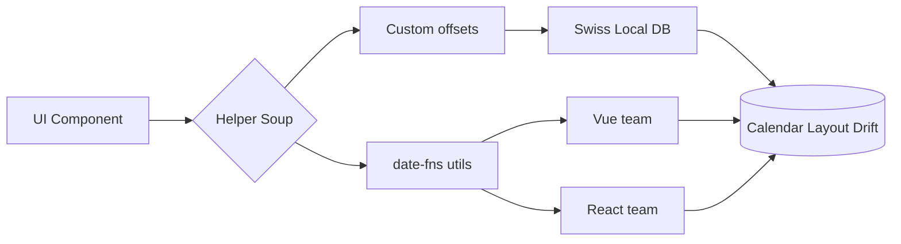
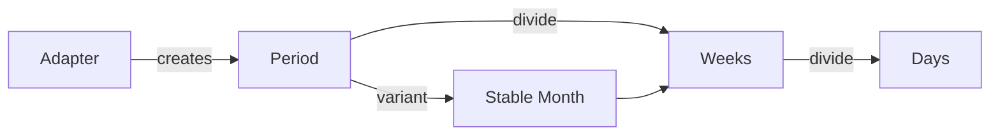
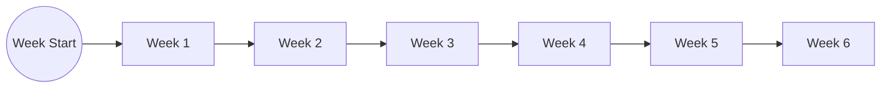

# Visual Guide to Building Reliable Calendars

### Step-by-step visuals from pain to solution

<div class="text-lg opacity-80">
  Aleksej Dix · Principal Engineer · Ally Studio
</div>

<div class="mt-4 text-sm opacity-60">
  Follow the visuals, adopt the steps, stop apologizing for calendars.
</div>

---

layout: center
class: text-left

---

# The Journey In Six Visual Steps

<div class="grid grid-cols-3 gap-4 mt-12 text-left">
  <div class="bg-white/5 border border-white/10 rounded-xl p-4">
    <div class="text-3xl font-bold">01</div>
    <div class="text-base uppercase tracking-widest opacity-70">Context</div>
    <p class="mt-3 text-sm opacity-80">Swiss-local DBs, traveling users, invisible drift.</p>
  </div>
  <div class="bg-white/5 border border-white/10 rounded-xl p-4">
    <div class="text-3xl font-bold">02</div>
    <div class="text-base uppercase tracking-widest opacity-70">Pain Map</div>
    <p class="mt-3 text-sm opacity-80">Imperative helpers, unstable layouts.</p>
  </div>
  <div class="bg-white/5 border border-white/10 rounded-xl p-4">
    <div class="text-3xl font-bold">03</div>
    <div class="text-base uppercase tracking-widest opacity-70">Architecture</div>
    <p class="mt-3 text-sm opacity-80">Adapter → Period → divide() → Stable Month.</p>
  </div>
  <div class="bg-white/5 border border-white/10 rounded-xl p-4">
    <div class="text-3xl font-bold">04</div>
    <div class="text-base uppercase tracking-widest opacity-70">Before/After</div>
    <p class="mt-3 text-sm opacity-80">Plain JS comparison.</p>
  </div>
  <div class="bg-white/5 border border-white/10 rounded-xl p-4">
    <div class="text-3xl font-bold">05</div>
    <div class="text-base uppercase tracking-widest opacity-70">Demo Flow</div>
    <p class="mt-3 text-sm opacity-80">Live steps to inspect periods.</p>
  </div>
  <div class="bg-white/5 border border-white/10 rounded-xl p-4">
    <div class="text-3xl font-bold">06</div>
    <div class="text-base uppercase tracking-widest opacity-70">Adoption</div>
    <p class="mt-3 text-sm opacity-80">Checklist for teams.</p>
  </div>
</div>

---

layout: center
class: text-left

---

# Mobility Story — October 26

<DstReminder />

---

# Step 01 · DST Story (2/3)

<div class="grid grid-cols-2 gap-4 text-left">
  <div class="bg-white/5 rounded-xl p-4">
    <div class="text-xs uppercase tracking-wide opacity-60">Pickup</div>
    <p class="text-sm mt-2 opacity-85">
      App thought I was an hour early and refused to unlock the car.
    </p>
  </div>
  <div class="bg-white/5 rounded-xl p-4">
    <div class="text-xs uppercase tracking-wide opacity-60">Return & Fuel</div>
    <p class="text-sm mt-2 opacity-85">
      System logged me an hour late and the gas station card declined because it thought I was outside the booking window.
    </p>
  </div>
</div>

---

# Step 01 · DST Story (3/3)

- Support double-charged me while “investigating”.
- This is the same failure class we see with Swiss-local databases at enterprise scale.

<div class="grid grid-cols-2 gap-4 text-left">
  <div class="bg-white/5 rounded-xl p-4">
    <div class="text-xs uppercase tracking-wide opacity-60">23:30</div>
    <p class="text-sm mt-2 opacity-85">
      Booking & calendar both “Swiss time” but display different hours.
    </p>
  </div>
  <div class="bg-white/5 rounded-xl p-4">
    <div class="text-xs uppercase tracking-wide opacity-60">23:45</div>
    <p class="text-sm mt-2 opacity-85">
      Car lock refuses to open because the app thinks I'm early.
    </p>
  </div>
  <div class="bg-white/5 rounded-xl p-4">
    <div class="text-xs uppercase tracking-wide opacity-60">01:00</div>
    <p class="text-sm mt-2 opacity-85">
      Return logged late; fuel card declines because the system thinks I'm outside the slot.
    </p>
  </div>
  <div class="bg-white/5 rounded-xl p-4">
    <div class="text-xs uppercase tracking-wide opacity-60">02:00</div>
    <p class="text-sm mt-2 opacity-85">
      Support double-charges while “investigating” the mismatch.
    </p>
  </div>
</div>

---

# Step 02 · Pain Map (Visual)



- Every framework had its own version of helpers.
- Layout drift cascaded to QA and release teams.
- No central object to inspect; debugging meant logging random Dates.

---

# Step 02 · Imperative Builder (Code)

```js {1-18|3-5|7-16}
import {
  addDays,
  startOfWeek,
  startOfMonth,
  isSameMonth,
  format,
} from "date-fns";

function buildGrid(cursor, weekStartsOn = 1) {
  const first = startOfWeek(startOfMonth(cursor), { weekStartsOn });
  return Array.from({ length: 42 }, (_, index) => {
    const date = addDays(first, index);
    return {
      date,
      label: format(date, "d"),
      isCurrentMonth: isSameMonth(date, cursor),
    };
  });
}
```

<div class="mt-6 text-sm opacity-70">
  Visual issue: each cell is a raw Date with flags—nothing ties rows together, so layouts shake.
</div>

---

# Step 03 · Architecture Sketch



- Adapter = time math brain (Temporal or Date).
- Period = plain object units we can log/test.
- divide() gives deterministic slices.
- Stable Month ensures UI surfaces stay aligned.

<div class="mt-4 text-sm opacity-70">
  Horizontal flow clarifies how data moves: Adapter → Period → Weeks → Days, with Stable Month branching to keep layout steady.
</div>

---

# Step 03 · Key Building Blocks

<div class="grid grid-cols-3 gap-4 text-left">
  <div class="bg-white/5 rounded-xl p-4">
    <div class="text-sm uppercase tracking-wide opacity-60">Adapter</div>
    <p class="text-lg font-bold mt-1">4 operations</p>
    <p class="text-sm opacity-80 mt-2">`startOf`, `endOf`, `add`, `diff`</p>
  </div>
  <div class="bg-white/5 rounded-xl p-4">
    <div class="text-sm uppercase tracking-wide opacity-60">Period</div>
    <p class="text-lg font-bold mt-1">Serializable slice</p>
    <p class="text-sm opacity-80 mt-2">`{ start, end, type, date }`</p>
  </div>
  <div class="bg-white/5 rounded-xl p-4">
    <div class="text-sm uppercase tracking-wide opacity-60">Stable Month</div>
    <p class="text-lg font-bold mt-1">Always 6 rows</p>
    <p class="text-sm opacity-80 mt-2">Aligned to `weekStartsOn`</p>
  </div>
</div>

---

## layout: two-cols

# Step 04 · After (Vue + `useTemporal`)

```vue {1-16|2-7|9-14}
<!-- App.vue -->
<script setup lang="ts">
import { ref } from "vue";
import { Temporal } from "@allystudio/usetemporal-vue";
import { createNativeAdapter } from "@allystudio/usetemporal/native";

const adapter = createNativeAdapter({
  weekStartsOn: 1,
  timeZone: "Europe/Zurich",
});
const date = ref(new Date("2025-03-13"));
</script>

<template>
  <Temporal :adapter="adapter" :date="date">
    <MonthGrid />
  </Temporal>
</template>
```

::right::

```vue {1-23|4-7|9-20}
<!-- MonthGrid.vue -->
<script setup lang="ts">
import { computed } from "vue";
import { useTemporal } from "@allystudio/usetemporal-vue";
import { UNITS } from "@allystudio/usetemporal";
import { createStableMonth } from "@allystudio/usetemporal/calendar";

const temporal = useTemporal();

const grid = computed(() => {
  const month = createStableMonth(
    temporal.adapter,
    temporal.weekStartsOn,
    temporal.browsing.value.date
  );

  return temporal.divide(month, UNITS.week).map((week) =>
    temporal.divide(week, UNITS.day).map((day) => ({
      period: day,
      label: day.start.getDate().toString(),
      inMonth: temporal.contains(month, day),
    }))
  );
});
</script>

<template>
  <div class="weeks">
    <div v-for="(week, w) in grid" :key="w" class="week">
      <button
        v-for="day in week"
        :key="day.period.start.toISOString()"
        class="day"
        :class="{ 'day--muted': !day.inMonth }"
      >
        {{ day.label }}
      </button>
    </div>
  </div>
</template>
```

<div class="mt-6 text-sm opacity-70">
  Visual: `Temporal` provides context once; child components call `useTemporal()` and only worry about rendering the period graph.
</div>

---

# Step 04 · Calendar Superpowers (Live)

<CalendarSuperpowers />

<div class="mt-6 text-sm opacity-70">
  Toggle week starts and timezones. Note how the grid stays six rows while launch/blackout ranges follow automatically.
</div>

---

# Step 04 · Timezone Offsets At A Glance

<TimezoneShowcase />

<div class="mt-6 text-sm opacity-70">
  Kiritimati is 14 hours ahead of UTC, Niue is 11 hours behind. Stable month renders the same structure even when local days shift dramatically.
</div>

---

# Step 04 · Daylight Saving Chaos

<div class="grid grid-cols-3 gap-4 text-left">
  <div class="bg-white/5 rounded-xl p-4">
    <p class="eyebrow">Europe / US</p>
    <p class="text-lg font-semibold">Shift twice a year</p>
    <p class="text-sm opacity-80">
      March: 23-hour day · October: 25-hour day  
      Switzerland inherits EU rules, so local DBs drift if you don't normalize.
    </p>
  </div>
  <div class="bg-white/5 rounded-xl p-4">
    <p class="eyebrow">No DST Zones</p>
    <p class="text-lg font-semibold">Singapore · Niue · Kiritimati</p>
    <p class="text-sm opacity-80">
      Never shift. Niue is still on yesterday while Kiritimati is already on tomorrow, yet both expect stable grids.
    </p>
  </div>
  <div class="bg-white/5 rounded-xl p-4">
    <p class="eyebrow">Southern Hemisphere</p>
    <p class="text-lg font-semibold">New Zealand & friends</p>
    <p class="text-sm opacity-80">
      DST flips opposite the North. Any “single” calendar model must support both directions simultaneously.
    </p>
  </div>
</div>

<div class="mt-6 text-sm opacity-70">
  Stable periods + adapters keep math in UTC and labels local, so blackout blocks follow the real local day instead of guessing.
</div>

---

# Step 04 · Before vs After (Visual Cards)

<div class="grid grid-cols-2 gap-4 text-left">
  <div class="bg-red-500/10 border border-red-500/30 rounded-xl p-4">
    <div class="text-sm uppercase tracking-wide text-red-300">Before</div>
    <ul class="mt-3 space-y-2 text-sm">
      <li>Arrays of Date objects</li>
      <li>Logic duplicated per framework</li>
      <li>Layout rows vary (4–6)</li>
      <li>No common test surface</li>
    </ul>
  </div>
  <div class="bg-emerald-500/10 border border-emerald-500/30 rounded-xl p-4">
    <div class="text-sm uppercase tracking-wide text-emerald-300">After</div>
    <ul class="mt-3 space-y-2 text-sm">
      <li>Period graph reused everywhere</li>
      <li>Stable months guarantee 6 rows</li>
      <li>Adapters encapsulate timezone quirks</li>
      <li>Tests target divide() + adapters</li>
    </ul>
  </div>
</div>

---

## layout: center

# Step 05 · Demo Board (Horizontal)

<div class="flex flex-row items-stretch gap-4 justify-center text-left text-sm">
  <div class="flex-1 bg-white/5 rounded-xl p-4 border border-white/10">
    <div class="text-2xl font-bold">①</div>
    <p class="font-semibold mt-2 uppercase tracking-wide opacity-70">Pick Date</p>
    <p class="opacity-80 mt-1">`2025-03-13`, TZ=`Europe/Zurich`</p>
  </div>
  <div class="flex-1 bg-white/5 rounded-xl p-4 border border-white/10">
    <div class="text-2xl font-bold">②</div>
    <p class="font-semibold mt-2 uppercase tracking-wide opacity-70">Stable Month</p>
    <p class="opacity-80 mt-1">`createStableMonth(adapter, 1, date)`</p>
  </div>
  <div class="flex-1 bg-white/5 rounded-xl p-4 border border-white/10">
    <div class="text-2xl font-bold">③</div>
    <p class="font-semibold mt-2 uppercase tracking-wide opacity-70">Weeks</p>
    <p class="opacity-80 mt-1">`divide(..., UNITS.week)`</p>
  </div>
  <div class="flex-1 bg-white/5 rounded-xl p-4 border border-white/10">
    <div class="text-2xl font-bold">④</div>
    <p class="font-semibold mt-2 uppercase tracking-wide opacity-70">Days</p>
    <p class="opacity-80 mt-1">`divide(week, UNITS.day)`</p>
  </div>
  <div class="flex-1 bg-white/5 rounded-xl p-4 border border-white/10">
    <div class="text-2xl font-bold">⑤</div>
    <p class="font-semibold mt-2 uppercase tracking-wide opacity-70">Render</p>
    <p class="opacity-80 mt-1">Log periods, feed UI, add tests.</p>
  </div>
</div>

---

# Step 05 · Stable Month Visual



- Always 6 nodes (weeks), arranged left-to-right like the UI grid.
- Each week knows its start/end, so virtualization and keyboard navigation never shift.
- Adapter handles Swiss-local vs UTC offsets; the graph shape stays identical.

---

layout: two-cols
class: text-left

---

# Step 05 · Natural Month Shapes

```text
4-week month (Feb 2026) · starts on Monday
Row 1: [Mon] 01  02  03  04  05  06
Row 2: [Mon] 08  09  10  11  12  13
Row 3: [Mon] 15  16  17  18  19  20
Row 4: [Mon] 22  23  24  25  26  27
```

```text
5-week month (Apr 2025) · starts mid-week
Row 1: --  --  -- [Thu] 01  02  03
Row 2: [Thu] 04  05  06  07  08  09
Row 3: [Thu] 11  12  13  14  15  16
Row 4: [Thu] 18  19  20  21  22  23
Row 5: [Thu] 25  26  27  28  29  30
```

```text
6-week month (Aug 2025) · starts late
Row 1: --  --  --  -- [Fri] 01  02
Row 2: [Fri] 03  04  05  06  07  08
Row 3: [Fri] 10  11  12  13  14  15
Row 4: [Fri] 17  18  19  20  21  22
Row 5: [Fri] 24  25  26  27  28  29
Row 6: [Fri] 31  --  --  --  --  --
```

::right::

```text
Stable month (always 6 rows)
Row 1: [Mon][29][30][01][02][03][04]
Row 2: [Mon][05][06][07][08][09][10]
Row 3: [Mon][12][13][14][15][16][17]
Row 4: [Mon][19][20][21][22][23][24]
Row 5: [Mon][26][27][28][29][30][31]
Row 6: [Mon][02][03][04][05][06][07]
```

- Natural months swing between 4–6 rows, forcing layouts to jump.
- Stable month pads with previous/next month days (`[...]`) to keep six uniform rows and a consistent `[Mon]` leading column.
- Rendering code can rely on a single shape, regardless of actual month length.

---

# Step 06 · Adoption Checklist (Visual)

<div class="grid grid-cols-2 gap-4 text-left">
  <div class="bg-white/5 rounded-xl p-4">
    <div class="text-sm uppercase tracking-wide opacity-60">Audit</div>
    <ul class="mt-3 space-y-2 text-sm opacity-90">
      <li>Map every time-slicing feature.</li>
      <li>Log where Swiss-local assumptions hide.</li>
    </ul>
  </div>
  <div class="bg-white/5 rounded-xl p-4">
    <div class="text-sm uppercase tracking-wide opacity-60">Prototype</div>
    <ul class="mt-3 space-y-2 text-sm opacity-90">
      <li>Replace one flow with `createStableMonth → divide`.</li>
      <li>Write adapter tests for UTC vs Swiss local.</li>
    </ul>
  </div>
  <div class="bg-white/5 rounded-xl p-4">
    <div class="text-sm uppercase tracking-wide opacity-60">Share</div>
    <ul class="mt-3 space-y-2 text-sm opacity-90">
      <li>Publish the period graph to every UI team.</li>
      <li>Document adapter contracts for backend + frontend.</li>
    </ul>
  </div>
  <div class="bg-white/5 rounded-xl p-4">
    <div class="text-sm uppercase tracking-wide opacity-60">Scale</div>
    <ul class="mt-3 space-y-2 text-sm opacity-90">
      <li>Add stable year / quarter flows.</li>
      <li>Monitor with period logs instead of raw Dates.</li>
    </ul>
  </div>
</div>

---

# Final Visual

<div class="bg-white/5 rounded-2xl p-8 text-left leading-relaxed">
  <p class="text-2xl font-semibold">Calendars behave when the data pipeline is visual, inspectable, and shared.</p>
  <p class="mt-4 opacity-80">
    `@allystudio/usetemporal` gives us the adapter, period, and divide primitives to make that pipeline real—even for Swiss-local databases that refuse UTC.
  </p>
  <p class="mt-6 text-sm opacity-70">Step through the visuals, implement the checklist, and let the UI finally be boring.</p>
</div>
