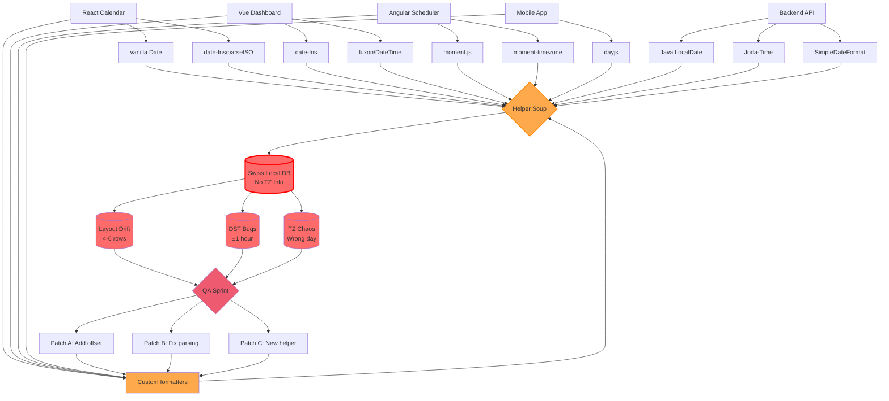
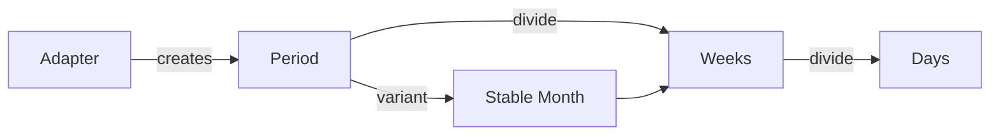

<h1 class="text-lg font-700">Minuta</h1>
<h1>Declarative Calendar Library</h1>

<div>
  Aleksej Dix · CTO @ Ally Studio and Head of Frontend @ Medidata
</div>

---

# How many hours are in a day?

---

# How many hours are in a day?

## 24

---

# How long does Earth need to rotate around itself?

---

# How long does Earth need to rotate around itself?

## 23h 56min 4sec

---

# How do we count time?

---

# How do we count time?

## Based on the sun's position relative to Earth

A **solar day** (noon to noon) averages 24h — not because Earth's rotation takes 24h, but because we also orbit the sun.

---

# How many hours are in a JavaScript day?

---

# How many hours are in a JavaScript day?

## 26

<HoursEvidence />

---

# How many weeks do we have in a month?

---

# How many weeks do we have in a month?

## 4 - 6

<WeeksEvidence />

---

# How many time zones are there?

---

# How many time zones are there?

## 39 unique UTC offsets

<OffsetsEvidence />

---

<h1 class="text-lg font-700 text-center">The Journey</h1>

<div class="grid grid-cols-3 gap-4 mt-12 text-left">
  <div class="bg-white/5 border border-black p-4">
    <div class="text-3xl font-bold">01</div>
    <div class="text-base uppercase tracking-widest opacity-70">Pain Map</div>
    <p class="mt-3 text-sm opacity-80">8+ date libraries, helper soup, Swiss-local DB chaos.</p>
  </div>
  <div class="bg-white/5 border border-black p-4">
    <div class="text-3xl font-bold">02</div>
    <div class="text-base uppercase tracking-widest opacity-70">The Code</div>
    <p class="mt-3 text-sm opacity-80">Imperative builders, hacks, and hardcoded grids.</p>
  </div>
  <div class="bg-white/5 border border-black p-4">
    <div class="text-3xl font-bold">03</div>
    <div class="text-base uppercase tracking-widest opacity-70">Key Insight</div>
    <p class="mt-3 text-sm opacity-80">Time is a hierarchy. Period + divide = everything.</p>
  </div>
  <div class="bg-white/5 border border-black p-4">
    <div class="text-3xl font-bold">04</div>
    <div class="text-base uppercase tracking-widest opacity-70">Architecture</div>
    <p class="mt-3 text-sm opacity-80">Adapter → Period → divide → Stable Month</p>
  </div>
  <div class="bg-white/5 border border-black p-4">
    <div class="text-3xl font-bold">05</div>
    <div class="text-base uppercase tracking-widest opacity-70">Live Demo</div>
    <p class="mt-3 text-sm opacity-80">Inspect periods, DST, timezones, month shapes.</p>
  </div>
  <div class="bg-white/5 border border-black p-4">
    <div class="text-3xl font-bold">06</div>
    <div class="text-base uppercase tracking-widest opacity-70">Adoption</div>
    <p class="mt-3 text-sm opacity-80">How to bring this to your team.</p>
  </div>
</div>

---

<h1 class="text-lg font-700 text-center">Pain Map</h1>



- **4 frontend teams** mixing 8+ date libraries (vanilla Date, date-fns, luxon, moment.js, dayjs...)
- **Backend** uses 3 different Java time APIs, all writing to Swiss Local DB with no timezone info
- Everything funnels through **"Helper Soup"** - a 2000+ line utility file nobody understands
- **3 failure modes**: Layout Drift (4-6 rows), DST Bugs (±1 hour), Timezone Chaos (wrong day)
- **The death spiral**: QA finds bugs → 3 new patches → Back to Custom formatters → More bugs
- No shared data model to inspect; each team logs incompatible formats

---

# Imperative Builder (Real Production Code)

```js {1-40|3-8|10-16|18-28|30-38}
// WARN: Do NOT touch this without testing Swiss local first!
// Last modified: 2023-10-27 (DST bug hotfix)
function buildCalendarGrid(cursor, weekStartsOn = 1) {
  const cells = [];

  // Get first of month in LOCAL time (critical for Swiss DB!)
  const monthStart = new Date(cursor.getFullYear(), cursor.getMonth(), 1);

  // BUG FIX 2022-03-15: was off by 1 during DST transition
  let dayOfWeek = monthStart.getDay();
  let offset = (dayOfWeek - weekStartsOn + 7) % 7;

  // HACK: Add 1 hour to avoid DST midnight weirdness
  // See ticket #4521 - March 2023 DST incident
  const gridStart = new Date(
    monthStart.getTime() - offset * 86400000 + 3600000
  );

  // Build 6 weeks (42 cells) - hardcoded because dynamic sizing broke QA
  for (let i = 0; i < 42; i++) {
    // Clone to avoid mutation bugs (learned the hard way)
    const cell = new Date(gridStart.getTime());
    cell.setDate(cell.getDate() + i);

    // FIXME: This breaks when user timezone != Swiss local
    // TODO: Refactor after Q2 launch (LOL never happens)
    const inMonth = cell.getMonth() === cursor.getMonth();
  }

  return cells;
}
```

---

<h1>Bugs in Every Row</h1>

<div>
  <ul>
    <li>DST hotfix with magic +1 hour offset (line 16)</li>
    <li>Hardcoded 42 cells because "dynamic sizing broke QA"</li>
    <li>Time zone assumptions baked into logic (line 25 comment)</li>
    <li>Multiple TODO/FIXME comments from 2022-2023</li>
    <li>No shared Period type—just raw Dates with boolean flags</li>
  </ul>
</div>

---

<h1 class="text-lg font-700 text-center">Hierarchy of Time</h1>

<div class="flex flex-col items-center gap-4 my-6">
  <div class="inline-block bg-cyan-400 border-3 border-cyan-700 rounded-lg px-6 py-3 font-bold text-gray-900">
    Year 2025
  </div>

  <div class="text-xl opacity-50">↓ divide</div>

  <div class="flex gap-2 items-center flex-wrap justify-center text-sm">
    <div class="bg-white/10 border-2 border-white/30 rounded px-3 py-1.5">Jan</div>
    <div class="bg-white/10 border-2 border-white/30 rounded px-3 py-1.5">Feb</div>
    <div class="bg-cyan-400 border-2 border-cyan-700 rounded px-3 py-1.5 font-bold text-gray-900">Mar</div>
    <div class="bg-white/10 border-2 border-white/30 rounded px-3 py-1.5">Apr</div>
    <div class="bg-white/10 border-2 border-white/30 rounded px-3 py-1.5">May</div>
    <div class="bg-white/10 border-2 border-white/30 rounded px-3 py-1.5">Jun</div>
    <div class="bg-white/10 border-2 border-white/30 rounded px-3 py-1.5">Jul</div>
    <div class="bg-white/10 border-2 border-white/30 rounded px-3 py-1.5">Aug</div>
    <div class="bg-white/10 border-2 border-white/30 rounded px-3 py-1.5">Sep</div>
    <div class="bg-white/10 border-2 border-white/30 rounded px-3 py-1.5">Oct</div>
    <div class="bg-white/10 border-2 border-white/30 rounded px-3 py-1.5">Nov</div>
    <div class="bg-white/10 border-2 border-white/30 rounded px-3 py-1.5">Dec</div>
  </div>

  <div class="text-xl opacity-50">↓ divide</div>

  <div class="flex gap-2 items-center flex-wrap justify-center text-sm">
    <div class="bg-white/10 border-2 border-white/30 rounded px-3 py-1.5">Mar 10</div>
    <div class="bg-white/10 border-2 border-white/30 rounded px-3 py-1.5">Mar 11</div>
    <div class="bg-white/10 border-2 border-white/30 rounded px-3 py-1.5">Mar 12</div>
    <div class="bg-cyan-400 border-2 border-cyan-700 rounded px-3 py-1.5 font-bold text-gray-900">Mar 13</div>
    <div class="bg-white/10 border-2 border-white/30 rounded px-3 py-1.5">Mar 14</div>
    <div class="bg-white/10 border-2 border-white/30 rounded px-3 py-1.5">Mar 15</div>
    <div class="bg-white/10 border-2 border-white/30 rounded px-3 py-1.5">Mar 16</div>
  </div>

  <div class="text-xl opacity-50">↓ divide</div>

  <div class="flex gap-2 items-center flex-wrap justify-center text-sm">
    <div class="bg-white/10 border-2 border-white/30 rounded px-3 py-1.5">00:00</div>
    <div class="bg-white/10 border-2 border-white/30 rounded px-3 py-1.5">01:00</div>
    <div class="bg-red-500 border-3 border-red-700 rounded px-3 py-1.5 font-bold text-white">02:00</div>
    <div class="bg-white/10 border-2 border-white/30 rounded px-3 py-1.5">03:00</div>
    <div class="bg-white/10 border-2 border-white/30 rounded px-3 py-1.5">04:00</div>
    <div class="bg-white/10 border-2 border-white/30 rounded px-3 py-1.5">05:00</div>
  </div>

  <div class="text-xl opacity-50">↓ divide</div>

  <div class="flex gap-2 items-center flex-wrap justify-center text-xs">
    <div class="bg-red-500 border-2 border-red-700 rounded px-2 py-1 font-bold text-white">02:00</div>
    <div class="bg-red-300 border-2 border-red-500 rounded px-2 py-1 text-gray-900">02:01</div>
    <div class="bg-red-300 border-2 border-red-500 rounded px-2 py-1 text-gray-900">02:02</div>
    <div class="bg-red-300 border-2 border-red-500 rounded px-2 py-1 text-gray-900">02:03</div>
    <div class="bg-red-300 border-2 border-red-500 rounded px-2 py-1 text-gray-900">02:04</div>
    <div class="bg-red-300 border-2 border-red-500 rounded px-2 py-1 text-gray-900">02:05</div>
  </div>
</div>

<div class="mt-4 text-sm opacity-80">
  <p><strong>The Pattern:</strong> Year → Month → Day → Hour → Minute → Second</p>
  <p class="mt-2">Every level is a <strong>Period</strong> with <code>{ start, end, type }</code></p>
  <p class="mt-2">The red hour (02:00-03:00)? That's the DST "spring forward" that <strong>doesn't exist</strong> in Switzerland on March 30.</p>
  <p class="mt-2"><strong>Minuta's divide() gives you ANY level from ANY starting period.</strong></p>
</div>

---

# Architecture Sketch



- Adapter = time math brain (Temporal or Date).
- Period = plain object units we can log/test.
- divide() gives deterministic slices.
- Stable Month ensures UI surfaces stay aligned.

<div class="mt-4 text-sm opacity-70">
  Horizontal flow clarifies how data moves: Adapter → Period → Weeks → Days, with Stable Month branching to keep layout steady.
</div>

---

# Key Building Blocks

<div class="grid grid-cols-4 gap-4 text-left">
  <div class="border p-4">
    <div class="text-sm uppercase tracking-wide ">Adapter</div>
    <p class="text-lg font-bold mt-1">4 operations</p>
    <p class="text-sm opacity-80 mt-2">startOf, endOf, add, diff</p>
  </div>
  <div class="border p-4">
    <div class="text-sm uppercase tracking-wide ">Period</div>
    <p class="text-lg font-bold mt-1">Serializable slice</p>
    <p class="text-sm opacity-80 mt-2">{ start, end, type, date }</p>
  </div>
  <div class="border p-4">
    <div class="text-sm uppercase tracking-wide ">Units</div>
    <p class="text-lg font-bold mt-1">Extensible types</p>
    <p class="text-sm opacity-80 mt-2">year, month, week, day...</p>
  </div>
  <div class="border p-4">
    <div class="text-sm uppercase tracking-wide ">Temporal</div>
    <p class="text-lg font-bold mt-1">State container</p>
    <p class="text-sm opacity-80 mt-2">browsing, now, config</p>
  </div>
</div>

---

# Minuta

```vue {1-16|2-7|9-14}
<!-- App.vue -->
<script setup lang="ts">
import { ref } from "vue";
import { Temporal } from "minuta-vue";
import { createNativeAdapter } from "minuta/native";

const adapter = createNativeAdapter({
  weekStartsOn: 1,
  timeZone: "Europe/Zurich",
});
const date = ref(new Date("2025-03-13"));
</script>

<template>
  <Temporal :adapter="adapter" :date="date">
    <MonthGrid />
  </Temporal>
</template>
```

---

```vue {all|4-7}
<!-- MonthGrid.vue -->
<script setup lang="ts">
import { computed } from "vue";
import { useTemporal, usePeriod } from "minuta-vue";
import { divide } from "minuta/operations";

const temporal = useTemporal();
const month = usePeriod(temporal, "month");
const days = computed(() => divide(temporal.adapter, month.value, "day"));
</script>

<template>
  <div class="calendar">
    <div v-for="day in days" :key="day.start.toISOString()">
      {{ day.start.getDate() }}
    </div>
  </div>
</template>
```

<div class="mt-6 text-sm opacity-70">
  <strong>Core primitives in action:</strong> <code>usePeriod()</code> creates a reactive month, <code>divide()</code> breaks it into days. That's the entire calendar logic.
</div>

---

# Live Demo — Calendar Superpowers

<CalendarSuperpowers />

---

<h1 class="text-lg font-700 text-center">Daylight Saving Time — October 26, 2025</h1>

<DstReminder />

---

# Timezone Offsets At A Glance

<TimezoneShowcase />

---

# Stable Month

```text
Natural month — variable rows
Feb 2027:  4 rows
Apr 2025:  5 rows
Mar 2025:  6 rows
```

The layout **jumps** every time the row count changes.

```text
Stable month — always 6 rows
 Mo  29  30  01  02  03  04
 Mo  05  06  07  08  09  10
 Mo  12  13  14  15  16  17
 Mo  19  20  21  22  23  24
 Mo  26  27  28  29  30  31
 Mo  02  03  04  05  06  07
```

Pads with previous/next month days. **One shape, every month.**

---

# Takeaway

<div class="grid grid-cols-3 gap-6 mt-8 text-left">
  <div class="border p-6">
    <div class="text-2xl font-bold mb-2">Period</div>
    <p class="text-sm opacity-80">Model time as <code>{ start, end, type }</code> — a shared, serializable, inspectable unit. No more raw Dates with boolean flags.</p>
  </div>
  <div class="border p-6">
    <div class="text-2xl font-bold mb-2">divide()</div>
    <p class="text-sm opacity-80">One function to slice any period into sub-periods. Year → months, month → days, day → hours. Deterministic, testable.</p>
  </div>
  <div class="border p-6">
    <div class="text-2xl font-bold mb-2">Adapter</div>
    <p class="text-sm opacity-80">Swap the time engine without changing your UI. Native Date today, Temporal API tomorrow. Four operations: startOf, endOf, add, diff.</p>
  </div>
</div>

<div class="mt-8 text-center opacity-70">
  <p>Use UTC for storage. Use Temporal API when it lands. Use <strong>Minuta</strong> now.</p>
</div>

---

# Thank you

<div class="mt-12 text-center">
  <p class="text-2xl font-bold">github.com/AleksejDix/minuta</p>
</div>
