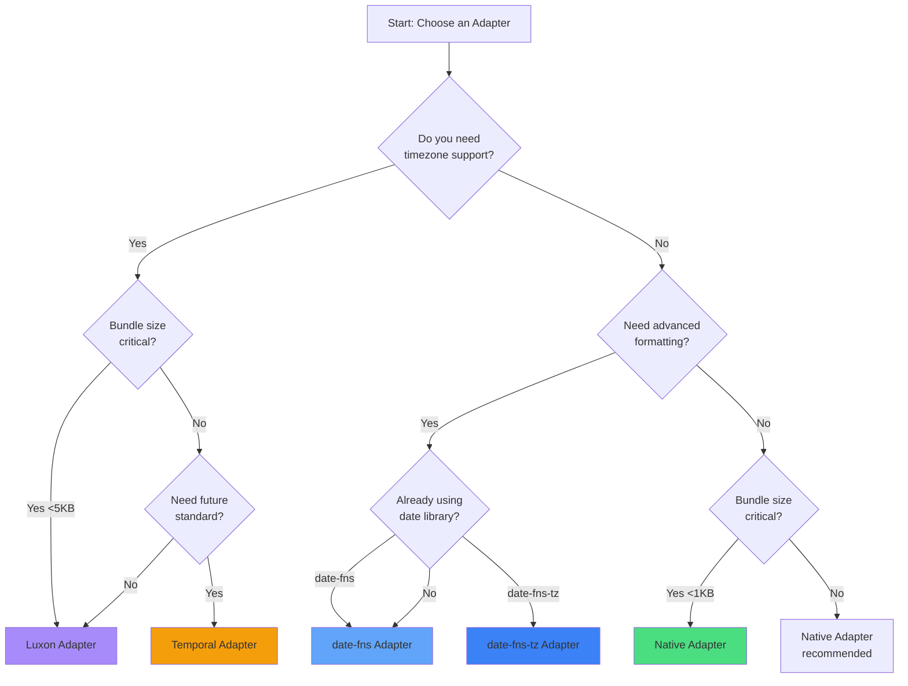

# Adapter Selection Guide

This guide helps you choose the right adapter for your project through a series of questions and use case scenarios.

## Quick Decision Flow



## Detailed Decision Criteria

### 1. Timezone Requirements

**Do you need to handle multiple timezones?**

- ✅ **Yes** → Consider **Luxon** or **Temporal**
  - Luxon: Battle-tested, mature timezone handling
  - Temporal: Future standard, most accurate

- ❌ **No** → Consider **Native** or **date-fns**
  - Native: Zero overhead, perfect for local dates
  - date-fns: Rich utilities without timezone complexity

### 2. Bundle Size Constraints

**What's your bundle size budget?**

| Budget | Recommended Adapters |
|--------|---------------------|
| < 1KB | **Native** only |
| < 3KB | Native, **date-fns**, date-fns-tz |
| < 5KB | All adapters |
| No limit | Any adapter |

### 3. Existing Dependencies

**Are you already using a date library?**

```typescript
// If using date-fns
import { format } from 'date-fns'
// → Use date-fns adapter to avoid duplication

// If using Luxon
import { DateTime } from 'luxon'
// → Use Luxon adapter for consistency

// If using date-fns with timezones
import { formatInTimeZone } from 'date-fns-tz'
// → Use date-fns-tz adapter
```

### 4. Project Type Scenarios

#### SaaS Dashboard
**Requirements:** Timezone support, recurring events, user preferences

**Recommendation:** **Luxon Adapter**
```typescript
const temporal = createTemporal({
  adapter: createLuxonAdapter({
    zone: userSettings.timezone,
    locale: userSettings.locale
  })
})
```

#### Mobile Web App
**Requirements:** Small bundle, fast performance, offline-capable

**Recommendation:** **Native Adapter**
```typescript
const temporal = createTemporal()
// Zero dependencies, maximum performance
```

#### Content Website
**Requirements:** SEO-friendly, locale formatting, fast initial load

**Recommendation:** **date-fns Adapter**
```typescript
const temporal = createTemporal({
  adapter: createDateFnsAdapter({
    locale: await import(`date-fns/locale/${userLocale}`)
  })
})
```

#### Enterprise Application
**Requirements:** Precision, standards compliance, long-term support

**Recommendation:** **Temporal Adapter**
```typescript
const temporal = createTemporal({
  adapter: createTemporalAdapter({
    calendar: 'iso8601',
    timeZone: 'UTC'
  })
})
```

## Use Case Comparison

### Event Scheduling App

| Requirement | Native | date-fns | Luxon | Temporal |
|-------------|--------|----------|-------|----------|
| Recurring events | ✅ | ✅ | ✅ | ✅ |
| Timezone conversion | ❌ | ❌ | ✅ | ✅ |
| DST handling | ❌ | ❌ | ✅ | ✅ |
| All-day events | ✅ | ✅ | ✅ | ✅ |
| **Best Choice** | | | **✅** | ✅ |

### Analytics Dashboard

| Requirement | Native | date-fns | Luxon | Temporal |
|-------------|--------|----------|-------|----------|
| Date ranges | ✅ | ✅ | ✅ | ✅ |
| Quick calculations | ✅ | ✅ | ✅ | ✅ |
| Performance critical | ✅ | ✅ | ❌ | ❌ |
| Minimal bundle | ✅ | ✅ | ❌ | ❌ |
| **Best Choice** | **✅** | ✅ | | |

### Blog/CMS

| Requirement | Native | date-fns | Luxon | Temporal |
|-------------|--------|----------|-------|----------|
| Format dates | ❌ | ✅ | ✅ | ✅ |
| Relative time | ❌ | ✅ | ✅ | ✅ |
| Locale support | ❌ | ✅ | ✅ | ✅ |
| SEO friendly | ✅ | ✅ | ✅ | ✅ |
| **Best Choice** | | **✅** | ✅ | |

## Migration Considerations

### From Vanilla JavaScript
```javascript
// Before
const date = new Date()
date.setHours(0, 0, 0, 0)

// After with Native adapter
const period = period(temporal, new Date(), 'day')
```

### From date-fns with Timezones
```javascript
// Before
import { zonedTimeToUtc } from 'date-fns-tz'
const utcDate = zonedTimeToUtc(new Date(), 'America/New_York')

// After with date-fns-tz adapter
const temporal = createTemporal({
  adapter: createDateFnsTzAdapter({ timezone: 'America/New_York' })
})
const period = period(temporal, new Date(), 'day')
```

### From date-fns
```javascript
// Before
import { startOfMonth, addWeeks } from 'date-fns'
const result = addWeeks(startOfMonth(new Date()), 1)

// After with date-fns adapter
const month = period(temporal, new Date(), 'month')
const result = go(temporal, month, 1, 'week')
```

## Performance vs Features Trade-off

```
Performance ←──────────────────────────→ Features
    │                                        │
    ├─ Native ─────────────────────────────┤
    │    ├─ date-fns ──────────────────────┤
    │         ├─ date-fns-tz ───────────────┤
    │              ├─ Luxon ─────────────────┤
    │                   ├─ Temporal ─────────┤
```

## Decision Checklist

Use this checklist to guide your decision:

- [ ] **Timezone support needed?** → Luxon or Temporal
- [ ] **Bundle size < 1KB?** → Native only
- [ ] **Already using a date library?** → Use matching adapter
- [ ] **Need locale formatting?** → date-fns, Luxon, or Temporal
- [ ] **Building for the future?** → Temporal
- [ ] **Need maximum performance?** → Native
- [ ] **Complex date math?** → Luxon or Temporal
- [ ] **Simple project?** → Native

## Switching Adapters

Adapters can be switched with minimal code changes:

```typescript
// Start with Native
let temporal = createTemporal()

// Later, switch to Luxon for timezone support
temporal = createTemporal({
  adapter: createLuxonAdapter({ zone: 'local' })
})

// All your code continues to work!
const period = period(temporal, new Date(), 'month')
```

## Next Steps

- Review individual adapter guides for detailed setup
- Check our [Migration Guide](./migration.md) for switching
- See [Performance Guide](/guide/performance) for optimization
- Try our [Interactive Playground](/interactive/adapter-comparison) to test adapters