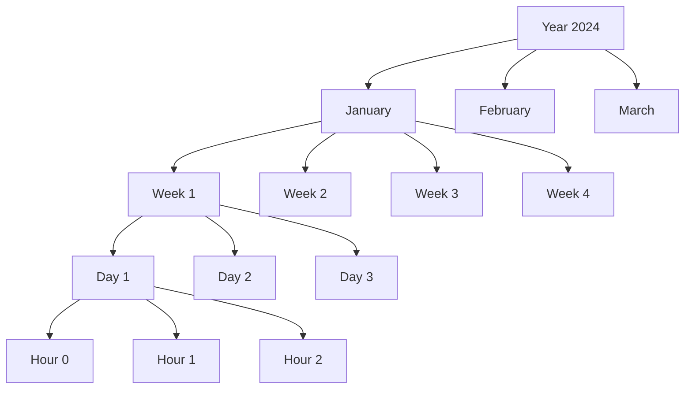

# The divide() Pattern

The `divide()` pattern is the **revolutionary core feature** that sets useTemporal apart from every other date library. It enables hierarchical time subdivision with perfect synchronization between parent and child time units.

## What Makes It Revolutionary

Unlike traditional date libraries that treat time as isolated points, useTemporal introduces a **hierarchical time model** where any time period can be subdivided into smaller units while maintaining reactive synchronization.

::: info Why This Matters
Traditional approaches require manual calculation and state management for time subdivisions. The divide() pattern automates this with a single, elegant function call.
:::

## Core Concept

Think of time as a **tree structure** where each node can be subdivided into smaller units:



## Basic Usage

### Level 1: Pure Functions

```typescript
import { period, divide } from '@allystudio/usetemporal/operations'
import { createNativeAdapter } from '@allystudio/usetemporal/native'

const adapter = createNativeAdapter()

// Create a year period
const year = period(adapter, new Date(), 'year')

// Divide year into months - returns exactly 12 month periods
const months = divide(adapter, year, 'month')
console.log(months.length) // 12

// Each month is a Period object
const january = months[0]
console.log(january.date) // Date object for January 1st
console.log(january.start) // Start of January
console.log(january.end) // End of January

// Continue dividing - get all days in January
const days = divide(adapter, january, 'day')
console.log(days.length) // 31 (for January)
```

### Level 2: Builder API

```typescript
import { createTemporal } from '@allystudio/usetemporal'
import { createNativeAdapter } from '@allystudio/usetemporal/native'

const temporal = createTemporal({
  adapter: createNativeAdapter(),
  date: new Date()
})

// Create and divide using builder methods
const year = temporal.period(new Date(), 'year')
const months = temporal.divide(year, 'month')
console.log(months.length) // 12

// Continue dividing
const days = temporal.divide(months[0], 'day')
console.log(days.length) // 31
```

### Level 3: Reactive Composables

```typescript
import { computed } from '@vue/reactivity'
import { createTemporal, usePeriod } from '@allystudio/usetemporal'
import { divide } from '@allystudio/usetemporal/operations'
import { createNativeAdapter } from '@allystudio/usetemporal/native'

const temporal = createTemporal({
  adapter: createNativeAdapter(),
  date: new Date()
})

// Get the current year as a reactive period
const year = usePeriod(temporal, 'year')

// Reactive subdivision
const months = computed(() => divide(temporal.adapter, year.value, 'month'))
console.log(months.value.length) // 12
```

## Key Features

### 1. Infinite Subdivision

You can divide time units as deep as needed, creating a complete hierarchy:

```typescript
import { period, divide } from '@allystudio/usetemporal/operations'
import { createNativeAdapter } from '@allystudio/usetemporal/native'

const adapter = createNativeAdapter()
const year = period(adapter, new Date(), 'year')

// Level 1: Year → Months
const months = divide(adapter, year, 'month')

// Level 2: Month → Days
const days = divide(adapter, months[0], 'day')

// Level 3: Day → Hours
const hours = divide(adapter, days[0], 'hour')

// Level 4: Hour → Minutes
const minutes = divide(adapter, hours[0], 'minute')

// Level 5: Minute → Seconds
const seconds = divide(adapter, minutes[0], 'second')
```

### 2. Perfect Synchronization

All subdivisions automatically update when their parent changes:

```typescript
import { watch } from '@vue/reactivity'

const month = usePeriod(temporal, 'month')

// Create reactive subdivisions
const days = computed(() => divide(temporal.adapter, month.value, 'day'))

// Initial state - January has 31 days
console.log(days.value.length) // 31

// Navigate to February
temporal.browsing.value = next(temporal.adapter, month.value)

// Days automatically update!
console.log(days.value.length) // 28 or 29
```

### 3. Type-Safe Operations

Every operation is fully type-safe:

```typescript
import { divide } from '@allystudio/usetemporal/operations'
import { createNativeAdapter } from '@allystudio/usetemporal/native'

const adapter = createNativeAdapter()

// TypeScript knows these are valid units
const validDays = divide(adapter, month, 'day') // ✅
const validHours = divide(adapter, day, 'hour') // ✅

// TypeScript catches invalid operations
// const invalid = divide(adapter, month, 'invalid') // ❌ Type error
```

## Real-World Examples

### Building a Calendar View

```typescript
import { createTemporal, usePeriod, divide } from '@allystudio/usetemporal'
import { createNativeAdapter } from '@allystudio/usetemporal/native'

function createCalendarMonth(temporal: Temporal) {
  const month = usePeriod(temporal, 'month')
  const days = computed(() => divide(temporal.adapter, month.value, 'day'))
  
  const calendarGrid = computed(() => {
    const allDays = days.value
    const firstDay = allDays[0]
    const startPadding = firstDay.date.getDay()
    
    // Create calendar grid with padding
    const grid = []
    
    // Add empty cells for days before month starts
    for (let i = 0; i < startPadding; i++) {
      grid.push(null)
    }
    
    // Add all days of the month
    allDays.forEach(day => {
      grid.push({
        number: day.date.getDate(),
        isToday: isSame(temporal.adapter, day.date, new Date(), 'day'),
        isWeekend: day.date.getDay() === 0 || day.date.getDay() === 6,
        period: day
      })
    })
    
    // Group into weeks
    const weeks = []
    for (let i = 0; i < grid.length; i += 7) {
      weeks.push(grid.slice(i, i + 7))
    }
    
    return weeks
  })
  
  return { month, days, calendarGrid }
}
```

### Creating a Year Heatmap

```typescript
function createYearHeatmap(temporal: Temporal, data: Map<string, number>) {
  const year = usePeriod(temporal, 'year')
  const months = computed(() => divide(temporal.adapter, year.value, 'month'))
  
  const heatmap = computed(() => 
    months.value.map(month => {
      const days = divide(temporal.adapter, month, 'day')
      
      return {
        month: month.date.toLocaleDateString('en', { month: 'long' }),
        weeks: groupIntoWeeks(days.map(day => ({
          date: day.date,
          value: data.get(day.date.toISOString().split('T')[0]) || 0,
          weekDay: day.date.getDay()
        })))
      }
    })
  )
  
  return { year, heatmap }
}
```

### Building a Time Picker

```typescript
function createTimeSlots(temporal: Temporal, slotDuration = 30) {
  const day = usePeriod(temporal, 'day')
  const hours = computed(() => divide(temporal.adapter, day.value, 'hour'))
  
  const timeSlots = computed(() => {
    const slots = []
    
    // Business hours only (9 AM - 5 PM)
    const businessHours = hours.value.filter(hour => {
      const h = hour.date.getHours()
      return h >= 9 && h < 17
    })
    
    businessHours.forEach(hour => {
      const minutes = divide(temporal.adapter, hour, 'minute')
      
      // Create slots every 30 minutes
      for (let i = 0; i < 60; i += slotDuration) {
        const minute = minutes[i]
        slots.push({
          time: `${hour.date.getHours().toString().padStart(2, '0')}:${i.toString().padStart(2, '0')}`,
          hour: hour.date.getHours(),
          minute: i,
          isPast: minute.date < new Date(),
          isFuture: minute.date > new Date(),
          period: minute
        })
      }
    })
    
    return slots
  })
  
  return { day, timeSlots }
}
```

## Advanced Patterns

### Hierarchical Navigation

Create complex navigation structures with ease:

```typescript
import { ref, computed } from '@vue/reactivity'

interface DateNavigator {
  year: ComputedRef<Period>
  months: ComputedRef<Period[]>
  currentMonth: Ref<Period>
  days: ComputedRef<Period[]>
  
  selectMonth(index: number): void
  selectDay(day: Period): void
  goToToday(): void
}

function createDateNavigator(temporal: Temporal): DateNavigator {
  const year = usePeriod(temporal, 'year')
  const months = computed(() => divide(temporal.adapter, year.value, 'month'))
  const currentMonth = ref(months.value[new Date().getMonth()])
  
  const days = computed(() => 
    divide(temporal.adapter, currentMonth.value, 'day')
  )
  
  return {
    year,
    months,
    currentMonth,
    days,
    
    selectMonth(index: number) {
      currentMonth.value = months.value[index]
      temporal.browsing.value = months.value[index]
    },
    
    selectDay(day: Period) {
      temporal.browsing.value = day
    },
    
    goToToday() {
      temporal.browsing.value = temporal.period(new Date(), 'day')
    }
  }
}
```

### Comparative Analysis

Compare multiple time periods easily:

```typescript
function compareYears(year1: number, year2: number) {
  const temp1 = createTemporal({
    adapter: createNativeAdapter(),
    date: new Date(year1, 0, 1)
  })
  const temp2 = createTemporal({
    adapter: createNativeAdapter(),
    date: new Date(year2, 0, 1)
  })
  
  const y1 = usePeriod(temp1, 'year')
  const y2 = usePeriod(temp2, 'year')
  
  const months1 = divide(temp1.adapter, y1.value, 'month')
  const months2 = divide(temp2.adapter, y2.value, 'month')
  
  return months1.map((month1, index) => {
    const month2 = months2[index]
    const days1 = divide(temp1.adapter, month1, 'day')
    const days2 = divide(temp2.adapter, month2, 'day')
    
    return {
      month: month1.date.toLocaleDateString('en', { month: 'long' }),
      year1Days: days1.length,
      year2Days: days2.length,
      difference: days1.length - days2.length
    }
  })
}
```

## Working with Standard Units

The divide() pattern works seamlessly with all standard time units:

```typescript
import { period, divide } from '@allystudio/usetemporal/operations'
import { createNativeAdapter } from '@allystudio/usetemporal/native'

const adapter = createNativeAdapter()

// Year divided into quarters
const year = period(adapter, new Date(), 'year')
const quarters = divide(adapter, year, 'quarter') // 4 quarters

// Each quarter can be further divided into months
const q1Months = divide(adapter, quarters[0], 'month') // 3 months

// And months into days
const janDays = divide(adapter, q1Months[0], 'day') // ~31 days
```

::: tip Custom Time Periods
For custom time ranges, use the `period()` function with start/end dates:
```typescript
const customPeriod = period(adapter, {
  start: new Date(2024, 0, 1),
  end: new Date(2024, 2, 31)
})
const days = divide(adapter, customPeriod, 'day') // ~90 days
```
:::

## Performance Optimization

### Lazy Evaluation

Subdivisions are created on-demand for optimal performance:

```typescript
const year = usePeriod(temporal, 'year')
const months = divide(temporal.adapter, year.value, 'month')
// Only 12 Period objects created

// Days are created only when accessed
const januaryDays = divide(temporal.adapter, months[0], 'day') // 31 objects
const februaryDays = divide(temporal.adapter, months[1], 'day') // 28/29 objects
```

### Efficient Updates

When using computed properties, subdivisions update efficiently:

```typescript
const month = usePeriod(temporal, 'month')
const days = computed(() => divide(temporal.adapter, month.value, 'day'))

// Navigate to next month
temporal.browsing.value = next(temporal.adapter, month.value)

// Only the days array is recalculated, not the entire time tree
```

## Best Practices

### 1. Use Computed for Reactive Subdivisions

```typescript
// ✅ Good: Reactive subdivisions
const month = usePeriod(temporal, 'month')
const days = computed(() => divide(temporal.adapter, month.value, 'day'))

// ❌ Avoid: Manual subdivision
let days = divide(temporal.adapter, month.value, 'day')
watch(month, () => {
  days = divide(temporal.adapter, month.value, 'day')
})
```

### 2. Cache Static Subdivisions

```typescript
// ✅ Good: Cache subdivisions that don't change
const year2024 = temporal.period(new Date(2024, 0, 1), 'year')
const months2024 = divide(temporal.adapter, year2024, 'month')

// Use cached months multiple times
const januaryDays = divide(temporal.adapter, months2024[0], 'day')
const februaryDays = divide(temporal.adapter, months2024[1], 'day')
```

### 3. Use Appropriate Granularity

```typescript
// ✅ Good: Only divide to the level you need
const hours = divide(temporal.adapter, day, 'hour')

// ❌ Avoid: Unnecessary deep subdivision
const seconds = hours
  .flatMap(hour => divide(temporal.adapter, hour, 'minute'))
  .flatMap(minute => divide(temporal.adapter, minute, 'second'))
```

## Framework Integration

The divide() pattern works seamlessly across all frameworks:

::: code-group

```vue [Vue.js]
<template>
  <div class="calendar">
    <div v-for="(week, i) in weeks" :key="i" class="week">
      <div
        v-for="(day, j) in week"
        :key="j"
        class="day"
        :class="{ 
          today: day && isSame(temporal.adapter, day.date, new Date(), 'day'),
          empty: !day 
        }"
      >
        {{ day?.date.getDate() }}
      </div>
    </div>
  </div>
</template>

<script setup>
import { computed } from 'vue'
import { createTemporal, usePeriod, divide, isSame } from '@allystudio/usetemporal'
import { createNativeAdapter } from '@allystudio/usetemporal/native'

const temporal = createTemporal({
  adapter: createNativeAdapter()
})

const month = usePeriod(temporal, 'month')
const days = computed(() => divide(temporal.adapter, month.value, 'day'))

const weeks = computed(() => {
  const allDays = days.value
  const firstDay = allDays[0]
  const startPadding = (firstDay.date.getDay() + 6) % 7 // Monday = 0
  
  const weeks = []
  let week = Array(startPadding).fill(null)
  
  allDays.forEach(day => {
    week.push(day)
    if (week.length === 7) {
      weeks.push(week)
      week = []
    }
  })
  
  if (week.length > 0) {
    weeks.push([...week, ...Array(7 - week.length).fill(null)])
  }
  
  return weeks
})
</script>
```

```tsx [React]
import { useMemo } from 'react'
import { createTemporal, usePeriod, divide, isSame } from '@allystudio/usetemporal'
import { createNativeAdapter } from '@allystudio/usetemporal/native'

function Calendar() {
  const temporal = useMemo(() => createTemporal({
    adapter: createNativeAdapter()
  }), [])
  
  const month = usePeriod(temporal, 'month')
  const days = useMemo(() => 
    divide(temporal.adapter, month.value, 'day'),
    [month.value]
  )
  
  const weeks = useMemo(() => {
    const firstDay = days[0]
    const startPadding = (firstDay.date.getDay() + 6) % 7
    
    const weeks = []
    let week = Array(startPadding).fill(null)
    
    days.forEach(day => {
      week.push(day)
      if (week.length === 7) {
        weeks.push(week)
        week = []
      }
    })
    
    if (week.length > 0) {
      weeks.push([...week, ...Array(7 - week.length).fill(null)])
    }
    
    return weeks
  }, [days])
  
  return (
    <div className="calendar">
      {weeks.map((week, i) => (
        <div key={i} className="week">
          {week.map((day, j) => (
            <div
              key={j}
              className={`day ${
                day && isSame(temporal.adapter, day.date, new Date(), 'day') 
                  ? 'today' 
                  : ''
              } ${!day ? 'empty' : ''}`}
            >
              {day?.date.getDate()}
            </div>
          ))}
        </div>
      ))}
    </div>
  )
}
```

```svelte [Svelte]
<script>
  import { createTemporal, usePeriod, divide, isSame } from '@allystudio/usetemporal'
  import { createNativeAdapter } from '@allystudio/usetemporal/native'
  
  const temporal = createTemporal({
    adapter: createNativeAdapter()
  })
  
  const month = usePeriod(temporal, 'month')
  $: days = divide(temporal.adapter, $month, 'day')
  
  $: firstDay = days[0]
  $: startPadding = (firstDay.date.getDay() + 6) % 7
  
  $: weeks = (() => {
    const weeks = []
    let week = Array(startPadding).fill(null)
    
    days.forEach(day => {
      week.push(day)
      if (week.length === 7) {
        weeks.push(week)
        week = []
      }
    })
    
    if (week.length > 0) {
      weeks.push([...week, ...Array(7 - week.length).fill(null)])
    }
    
    return weeks
  })()
</script>

<div class="calendar">
  {#each weeks as week, i}
    <div class="week">
      {#each week as day, j}
        <div 
          class="day"
          class:today={day && isSame(temporal.adapter, day.date, new Date(), 'day')}
          class:empty={!day}
        >
          {day?.date.getDate() || ''}
        </div>
      {/each}
    </div>
  {/each}
</div>
```

:::

## Why divide() is Revolutionary

1. **No Manual Calculations**: Traditional libraries require you to calculate subdivisions manually. With divide(), it's automatic.

2. **Reactive by Default**: Changes propagate through the hierarchy automatically.

3. **Type-Safe**: Full TypeScript support ensures you can't divide incorrectly.

4. **Framework Agnostic**: Works identically across all JavaScript frameworks.

5. **Extensible**: Works with custom units just as well as built-in ones.

The divide() pattern transforms how we work with time in JavaScript, making complex time-based UIs simple and intuitive to build.